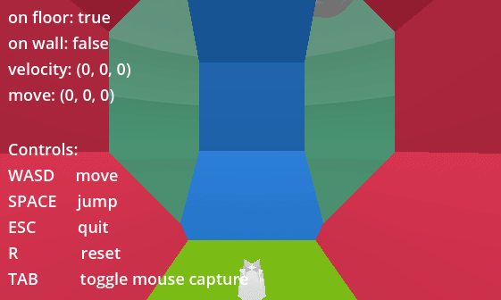

Made in Godot 4.1  

Bare minimum implementation of a (bad) wall climbing character in a 3D environment that allows for testing different angles and surfaces.

## Goals
The goal is to make a character that can: 
- easily walk on walls (not climb) so long as the angle isn't too steep (straight walls and walls leaning a little in your direction are OK).
- fall off sharp faces
- allow for jumping, leaping, and later, swimming.

## Caveats
This implemenatation currently doesn't work, as you can see here: 

## Copyright
If you find this, feel free to play around with it I guess. IDK the copyright laws yet.
